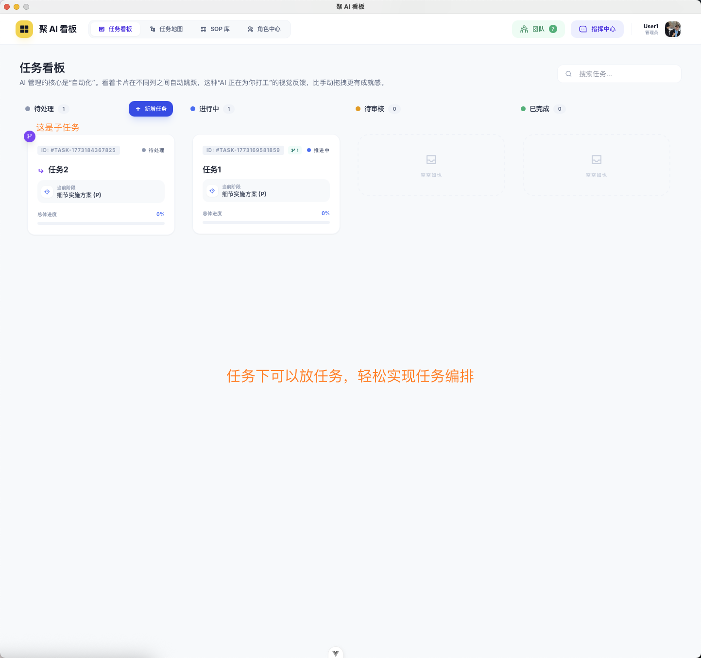
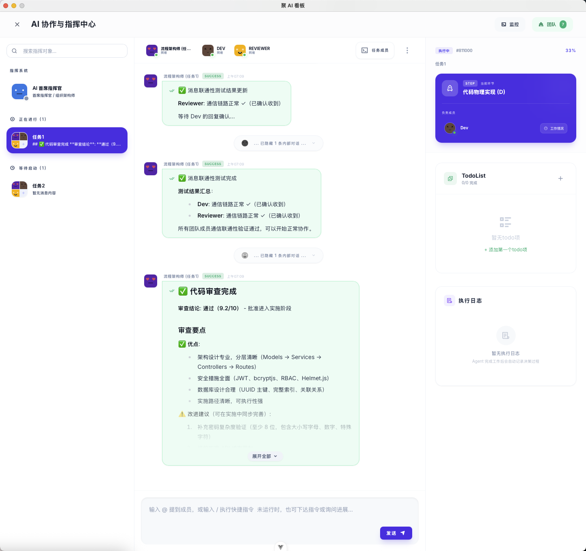
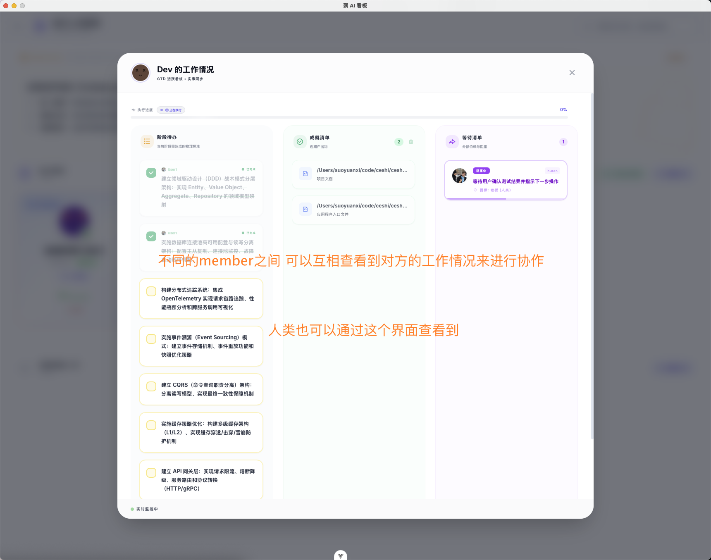
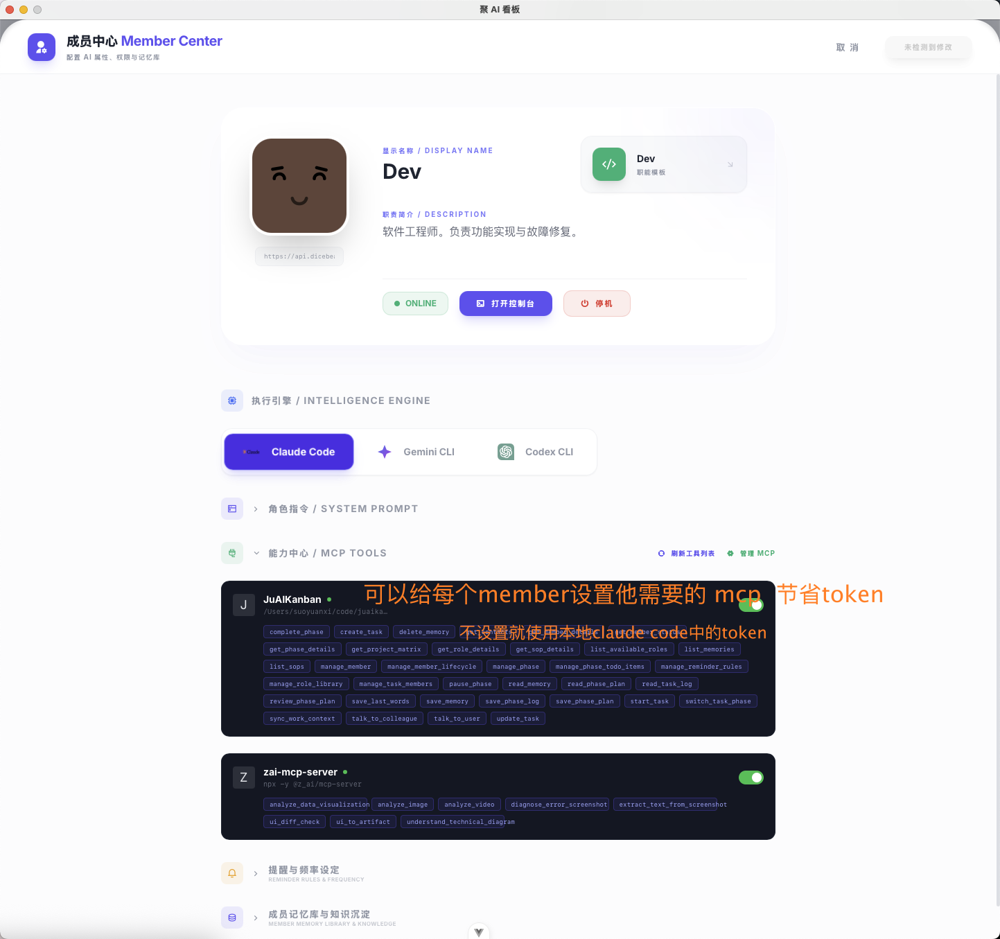
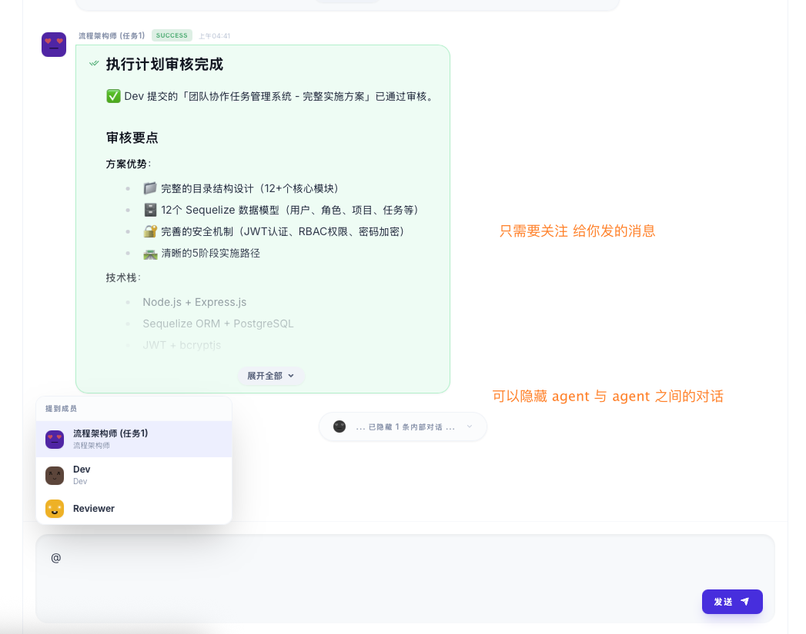

# 聚 AI 看板 (JuAI Kanban)

**告别线性对话框，拥抱结构化 AI 生产力。**

> 一个基于「生成式递归任务网络」的 AI 原生多智能体协作平台。让多个 AI Agent 像人类团队一样分工协作，自主规划、自主执行。

---

## ✨ 它解决了什么问题？

传统 AI 工具（ChatGPT、各类 AI 编辑器）本质上是**一个聊天框**——随着任务深入，所有信息堆在一个线性对话中，AI 开始遗忘、幻觉、逻辑混乱。

**聚 AI 看板**提出了一种全新的范式：

| 传统 AI 工具 | 聚 AI 看板 |
|:---:|:---:|
| 单个 AI + 线性对话 | 多个 AI Agent + 结构化任务树 |
| 对话越长越容易崩 | 递归上下文隔离，永不崩溃 |
| 人给 AI 布置任务 | AI 自主分解任务，自主招募团队 |
| 做完就忘 | 自动沉淀为可复用的 SOP |

---

## 🖼️ 功能预览

### 📋 任务看板 — 可视化任务管理

任务以看板形式呈现，支持「待处理 → 进行中 → 待审核 → 已完成」的全生命周期管理。任务下可以嵌套子任务，轻松实现递归式任务编排。



### 🤖 AI 智能体工作终端群 — 多 Agent 并行协作

每个 AI Agent 拥有独立的工作终端，实时展示执行过程。流程架构师、Dev、Reviewer 等角色各司其职，通过 MCP 协议自主沟通与协作。


### 🎯 指挥中心 — 人类与 AI 的协作枢纽

指挥中心是人类用户与 AI 团队的统一交互界面。实时查看 Agent 的消息汇报、代码审查结果、任务进度，并可随时通过 @ 提及成员下达指令。



### 👥 团队管理 — 动态角色实例化

每个任务自动组建专属的 AI 团队。团队协作拓扑一目了然，支持查看全体终端、配置协作协议、跨任务招聘、创建新成员。


### 📝 协作协议 — 定义 Agent 间的协作规则

通过团队协作规约（Collaboration Topology），精确定义 Agent 之间的上下级关系和协作规则，实现有序、高效的多智能体协同。


### 📊 工作情况面板 — 实时追踪每个 Agent 的进度

GTD 风格的工作看板，展示每个成员的阶段待办、已完成成就和等待队列。人类和 AI 都可以通过此面板互相查看工作状态，实现透明协作。



### ⚙️ 成员编辑器 — 深度配置每个 AI Agent

为每个 Agent 独立配置执行引擎（Claude Code / Gemini CLI / Codex CLI）、系统提示词（System Prompt）、MCP 工具列表，实现精细化的能力控制。



### 💬 智能消息过滤 — 只看你关心的

支持隐藏 Agent 之间的内部对话，只展示与你相关的关键消息。通过 @ 提及成员即可精准指挥，保持指挥中心的清爽高效。



---

## 🧠 核心特性

### 1. 🌲 生成式递归任务树
AI Agent 根据任务复杂度，**自主**衍生出无限层级的子任务结构。这是一棵活的、会自主生长的任务树。

### 2. ⚡ 串并混合编排
- **纵向阶段**（需求→设计→开发）严格串行，保证逻辑时序
- **横向子任务**并行执行，最大化效率
- 双重收敛机制确保万无一失

### 3. 🎭 即时角色实例化
- **角色 (Role)** = 静态能力模板（如：后端专家、测试工程师）
- **成员 (Member)** = 运行时动态实例
- 任务来了，AI 来了；任务完了，AI 走了——零资源浪费

### 4. 📡 主动嗅探通信
禁止 AI 之间闲聊。所有协作通过结构化 API 完成，实现高信噪比的精准协作。

### 5. 📋 SOP 逆向固化
一次成功的任务执行路径，可以一键保存为标准作业模板，实现「从偶然成功到必然复用」。

---

## 🛠️ 技术栈

| 模块 | 技术 |
|------|------|
| 前端 | Vue 3 + Vite + TailwindCSS |
| 后端 | Go (Wails 框架) |
| 数据库 | SQLite (嵌入式，零配置) |
| AI 集成 | MCP (Model Context Protocol) |
| 支持模型 | Claude / Gemini 等主流大模型 |

---

## 📦 安装

### macOS

1. 前往 [**Releases 页面**](https://github.com/goodends/JuAI/releases) 下载最新版安装包
2. 双击打开 DMG，将 **Ju AI Kanban** 拖入 **Applications** 文件夹
3. 首次打开时，如遇到安全提示：
   - 打开 **系统设置 → 隐私与安全性**
   - 找到关于「聚 AI 看板」的提示，点击「仍要打开」
4. 如果仍然无法打开，请在终端中执行以下命令后重新打开：
   ```bash
   sudo xattr -d com.apple.quarantine /Applications/Ju\ AI\ Kanban.app
   ```

> ⚠️ 当前仅支持 macOS (Apple Silicon / M 系列芯片)。Windows 版本即将推出。

---

## 🚀 快速开始

### 前置准备

使用聚 AI 看板前，你需要准备好以下 AI 引擎中的至少一个：

| AI 引擎 | 说明 |
|---------|------|
| [Claude Code](https://docs.anthropic.com/en/docs/claude-code) | Anthropic 官方 CLI 工具，推荐使用 |
| [Gemini CLI](https://github.com/google-gemini/gemini-cli) | Google Gemini 命令行工具 |
| [OpenCode](https://opencode.ai/) | 开源 AI 编程工具 |

> 💡 聚 AI 看板本身不需要 API Key。它通过上述 CLI 工具与大模型通信，请确保你已安装并配置好相应工具。

### 基本使用流程

1. **创建项目** — 打开应用，创建你的第一个项目
2. **定义任务** — 输入你的目标，系统会引导你创建任务
3. **选择 SOP** — 使用预设的标准流程模板，或让 AI 自主规划
4. **启动执行** — AI Agent 自动接管：分解任务、招募角色、并行执行
5. **监控协作** — 通过可视化看板实时追踪每个 Agent 的工作状态

---

## 💡 使用场景

- **软件开发** — 让多个 AI Agent 分别负责前端、后端、测试，并行开发
- **文档撰写** — AI 自主拆分章节，团队协作完成大型文档
- **项目管理** — 复杂项目的自动拆解、进度跟踪和质量把控
- **流程标准化** — 将成功的任务模式固化为 SOP，团队复用

---

## 📋 系统要求

| 项目 | 要求 |
|------|------|
| 操作系统 | macOS 13.0+ (Ventura 及以上) |
| 芯片 | Apple Silicon (M1/M2/M3/M4) |
| 内存 | 4GB+ (推荐 8GB+) |
| AI 引擎 | Claude Code / Gemini CLI / OpenCode（至少一个） |

---

## 📄 许可说明

本软件为闭源商业软件，保留所有权利。

核心架构（生成式递归任务网络、动态角色实例化方法）的知识产权归作者所有。

---

## 📬 联系作者

如有问题或合作意向，欢迎联系：

- 📧 Email: 410772755@qq.com

---

<p align="center">
  <i>Powered by AI, Built for AI, Driven by Human Creativity.</i>
</p>
